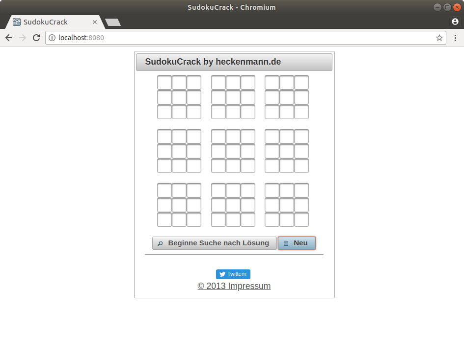

# sudokucrack
Löst jedes lösbare Sudoku-Rätsel.



## Docker run
```
docker run --name sudokucrack -p 8080:8080 heckenmann/sudokucrack
```
Die App ist dann unter
```
http://localhost:8080
```
erreichbar.


## Maven-Build
Kann mit

```
mvn clean install
```
gebaut werden.
Das war-File kann auf einem Glassfish oder Wildfly deployt werden.

Die App ist dann unter
```
http://localhost:8080/sudokucrack
```
erreichbar.

http://heckenmann.de/projekte/

## Docker-Build
```
docker build -t sudokucrack .
```